# 基础规则

棋盘：

19 * 19 的垂直线段相交。
共有 9 个星位，最中间的为 “天元”。

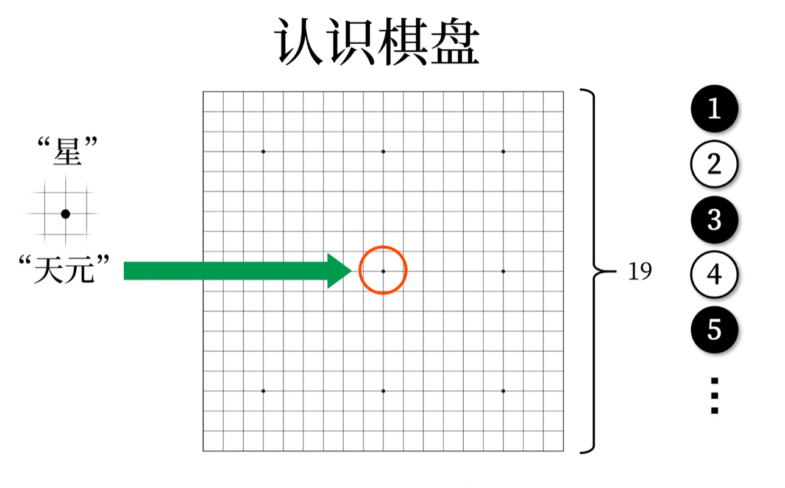  

气：

- 与棋子直接相连的交叉点称为 “气”。
- 只有横或竖相连的同色棋子才会共享 “气”，斜向不算相连。
- “气” 没有了，棋子就死了，称为 “提子”；棋子只剩一气，称为被 “打吃”。
- “不入气”，落子后没有 “气” 的棋子不能落子。
- “劫”
  - 互相提子的情况，不能循环提子，需要隔一手。
  - “劫材”：“打劫” 后，找一个对方必须跟着走的棋子

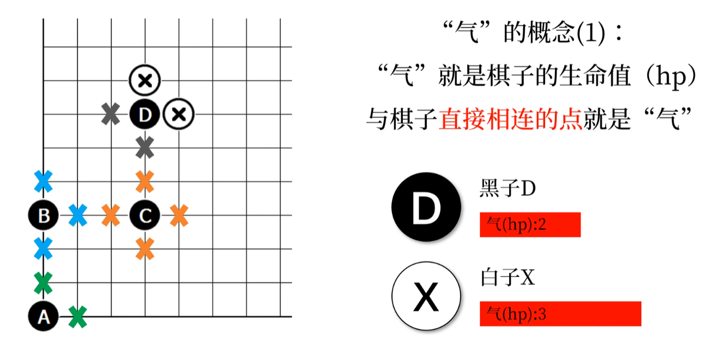 
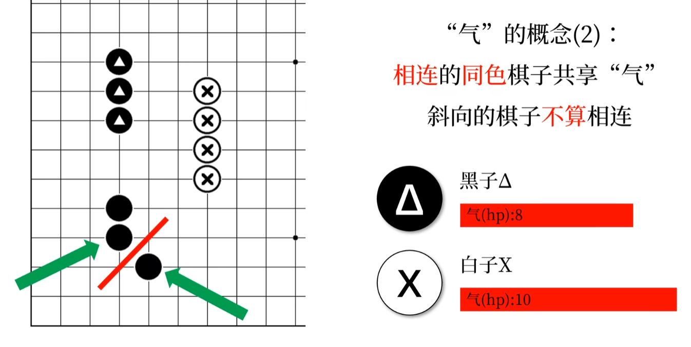  
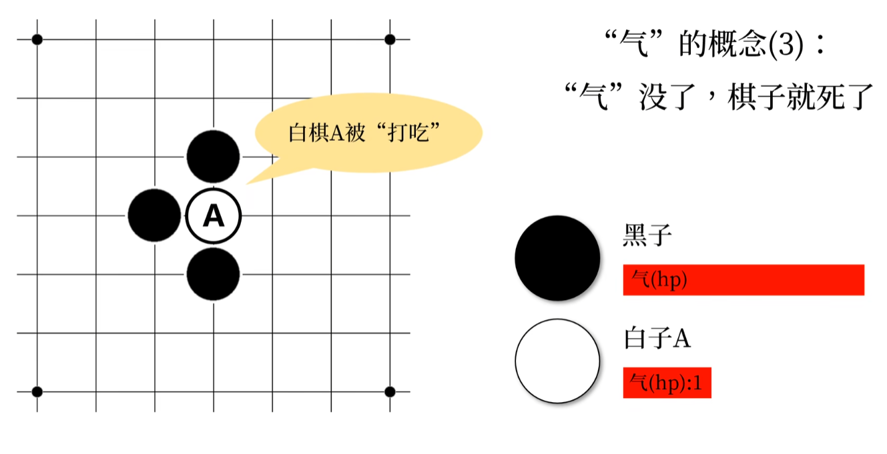  
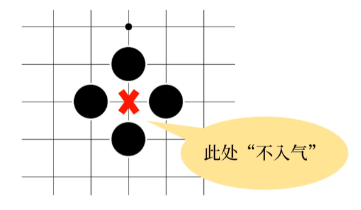 
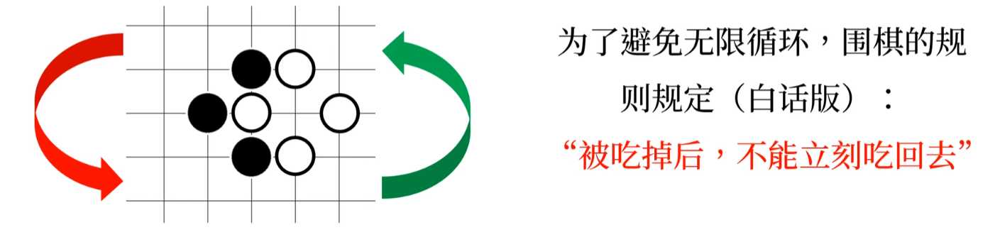  

死和活：

活棋：永远都有气的棋子。
眼：不入气的形状
  - 真眼
  - 假眼：会被 “打吃” 的眼

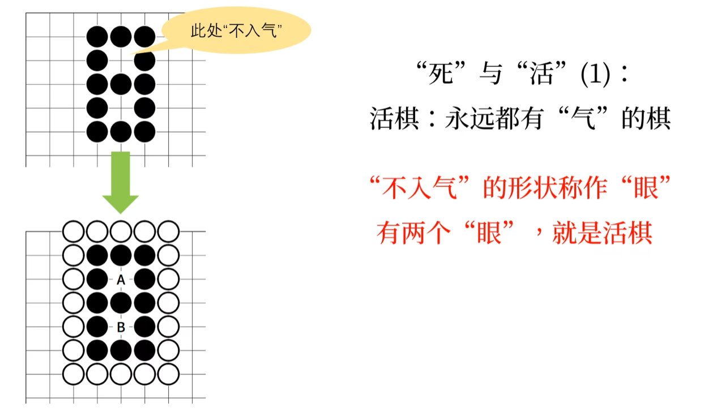  
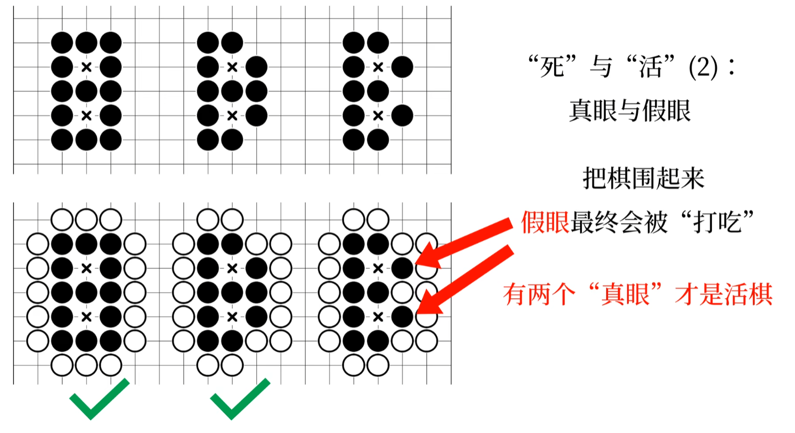  
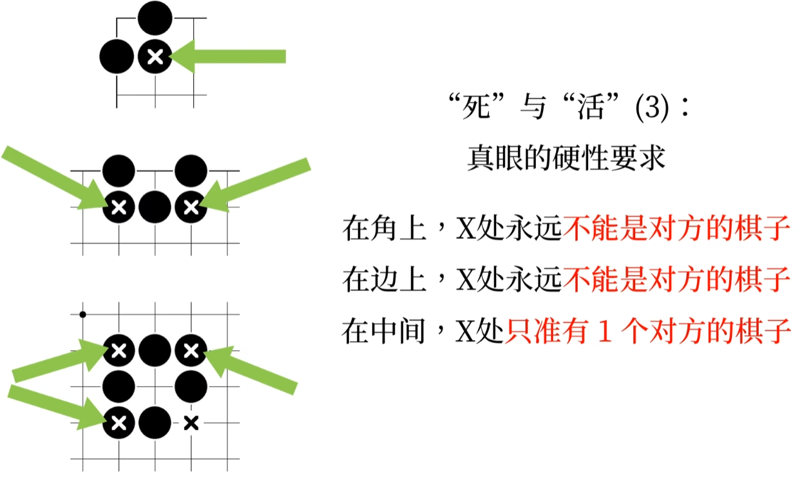  

围棋的胜负：
- 谁围的地方大，谁赢
- 围起来的区域叫做 “空”
- 计数单位叫做 “目”
- 每一个 ”死子“ 算 **2 目**，吃掉过对方棋子的地方算 **2 目**
- 吃掉过对方棋子、但现在被己方棋子占的地方，算 **1 目**。

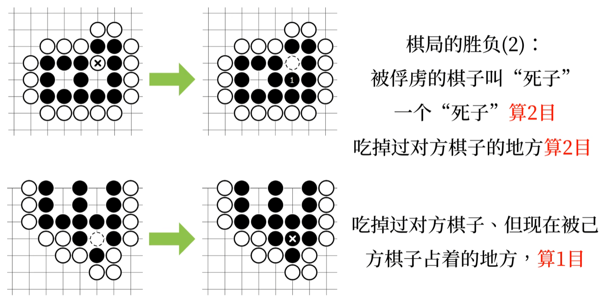  
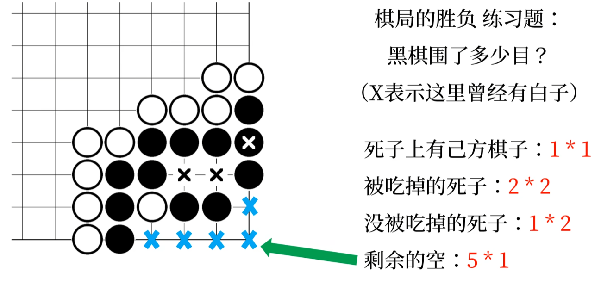  

> 执黑现行，所以结束时黑棋比白棋多 **7.5 目** 才算赢。
> 每个国家规则不同。
