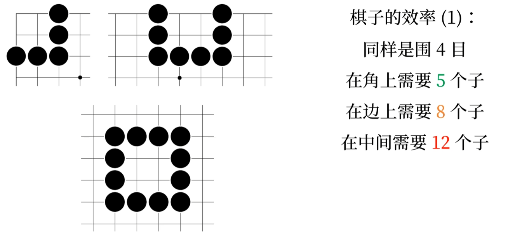
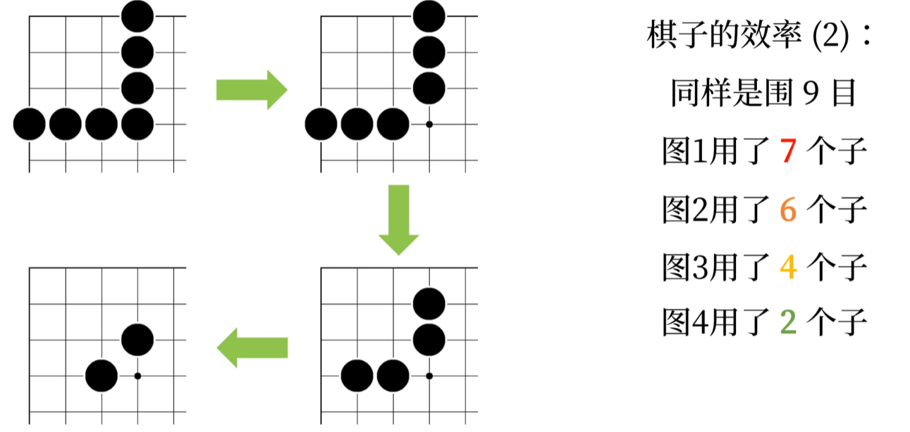
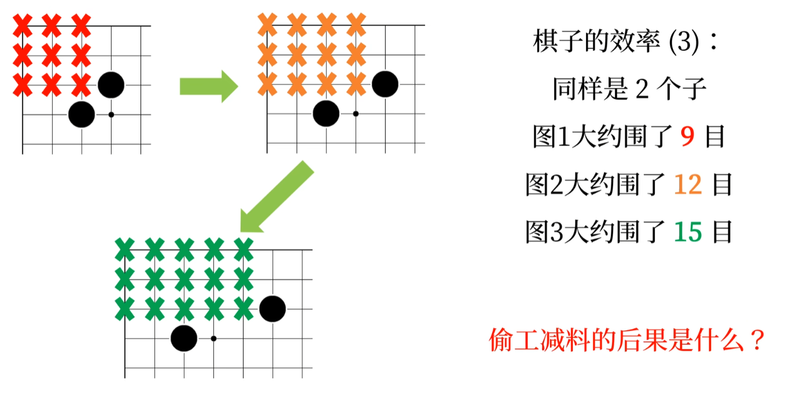
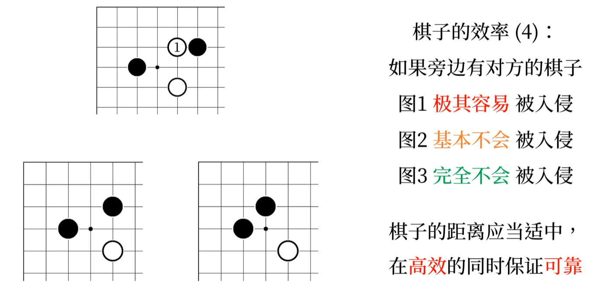
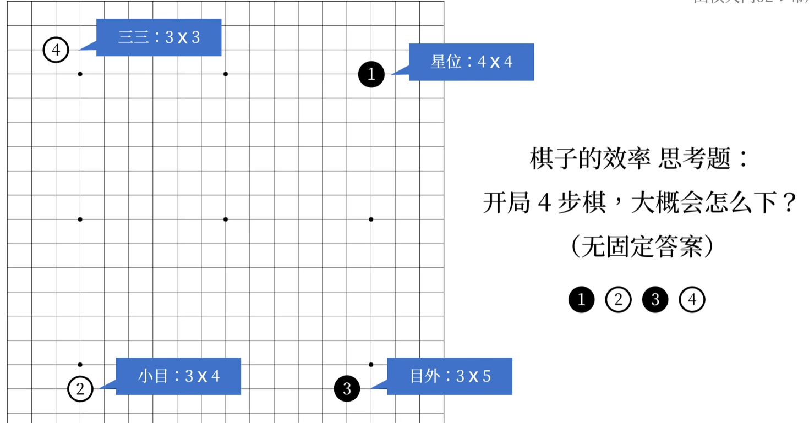
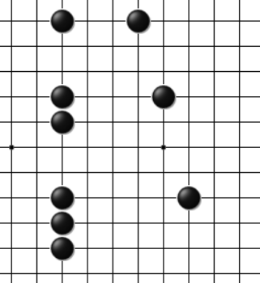

# 布局

## 1. 棋子的效率

效率（1）：
金边银角草肚皮。
同样是围四目：
- 角上需要 5 颗棋子
- 边上需要 8 颗棋子
- 中间需要 12 颗棋子

  

效率（2）
同样是围 9 目：可以 **偷工减料**

  

效率（3）
同样是 2 个子
  

效率（4）
如果旁边有对方的棋子，那么极有可能被对方入侵

  

根据以上的情况可以判断，开局四步棋最好下 4*4 星位
  

- 三三：3X3
- 小目：3X4
- 星位：4X4
- 目外：3X5
- 高目：5X4

第一步右上角的位置：一种礼仪

## 2. 棋子的间距

下一步：对方下棋。
斜向的棋子不算相连，但是它们联系是很紧密的。
横竖相隔一个空位，称为跳。
在边角上，常见的距离：
- 立一拆二
- 立二拆三
- 立三拆四

  

1. 你离对方多远，对方离你就有多远
2. 不要理己方棋子太远，否则要做好被断开的情况
3. 如果棋子远离边角，棋子更容易被断开
4. 想往远处发展，就要有强大的支撑。

## 3. 认识定式

**定式是双方在局部约定俗成的下法**
这样对双方基本公平，可以减少计算量，在脚步最为常见。
高手很少这么做。

## 4. 外势和实地

实地：已经被围住的“目”
外势：小范围内较高密度的棋子对外形成的威慑力。

## 5. 实战中的布局

